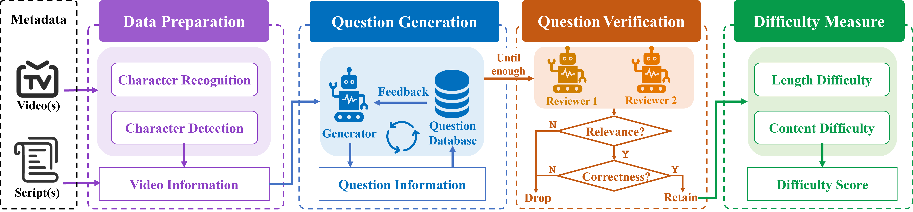

# FriendsQA: A New Large-Scale Deep Video Understanding Dataset with Fine-grained Topic Categorization for Story Videos


## FriendsQA datasets

- single-episode questions path: `FriendsQA/friendsqa_single.json`
- cross-episode questions path: `FriendsQA/friendsqa_cross.json`


## StoryMind Framework




## Quick Start

- Environment

  ```bash
  pip install -r requirements.txt
  ```

- Download shot-based instance search result of *Friends* from [ZQFive/shot_ins · Hugging Face](https://huggingface.co/ZQFive/shot_ins) 

  ```bash
  cd utils
  git clone https://huggingface.co/ZQFive/shot_ins
  ```

- Generator （Use `sh sh/generator.sh` to run）

  ```bash
  ### generator.sh
  python generator.py --google_api_key "Replace with your gemini api key" --num_workers 1  --worker 0  --begin 0  --end 250 
  ```

- Reviewer（Use `sh sh/reviewer.sh` to run）

  ```bash
  ### reviewer.sh
  python reviewer.py --gemini_model gemini-1.5-pro-latest \
                     --google_api_key "Replace with your gemini api key" \
                     --claude_model claude-3-5-sonnet-20240620 \
                     --claude_api_key "Replace with your claude api key" \
                     --claude_proxy "Replace with your claude proxy"
  ```

- Filter process

  ```bash
  python filter.py
  ```

And you will find questions in directory `json/`， default it will generate `json/single_episode_questions.json`


## About the StoryMind Framework

We are continuously optimizing and expanding our StoryMind framework to better adapt and apply it to various types of story videos. In the future, we plan to enhance the framework's flexibility and expressiveness by introducing new algorithms and technologies, ultimately providing users with a richer and more diverse creative experience.

We welcome community feedback and suggestions, and we look forward to exploring the many possibilities of StoryMind together.


## Citation

If you find this repository useful, please consider giving ⭐ or citing:

```
@inproceedings{wu2024friendsqa,
    title={FriendsQA: A New Large-Scale Deep Video Understanding Dataset with Fine-grained Topic Categorization for Story Videos},
    author={Wu, Zhengqian and Li, Ruizhe and Xu, Zijun and Wang, Zhongyuan and Xiao, Chunxia and Liang, Chao},
    booktitle={The 39th Annual AAAI Conference on Artificial Intelligence},
    year={2025},
}
```

